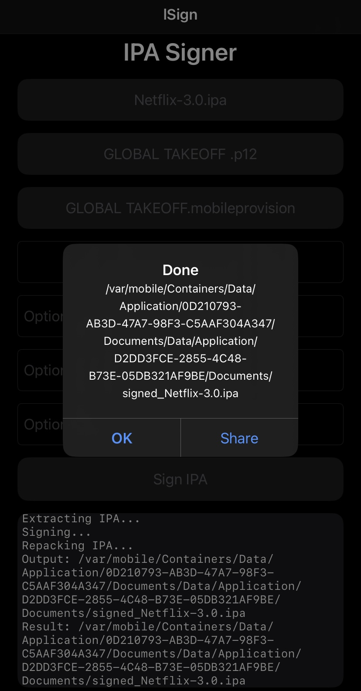
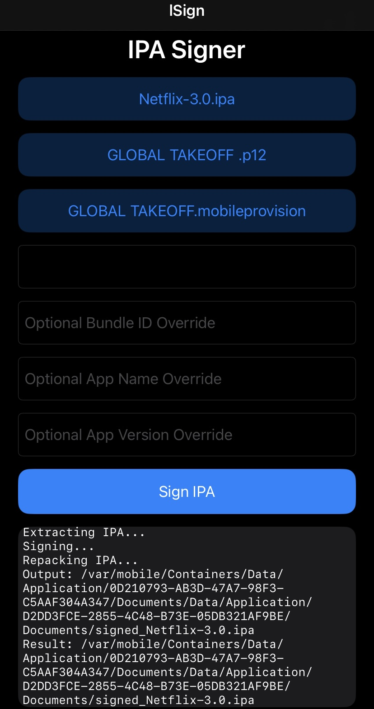

### lSign

An actually LIGHTWEIGHT app that gives you the signing without install feature when distributing IPA's!

---
## App Preview

- Context: lSign is running inside LiveContainer, hence why the duplicate container IDs.
- For LiveContainer users, toggle on "Fix File Picker" in App Settings before trying to sideload an IPA.

- 1st Screenshot

- 2nd Screenshot

---

## Performance

- Small IPAs (~5–10 MB): ~1 second  
- Medium IPAs (~20–50 MB): 5–15 seconds  
- Large IPAs (>50 MB): depends on size and embedded frameworks

---

**DISCLAIMER** : You are responsible for piracy or other illegal stuff.
